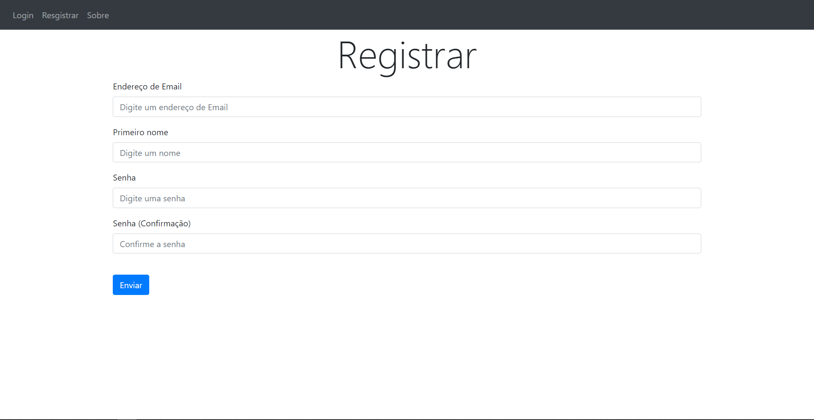
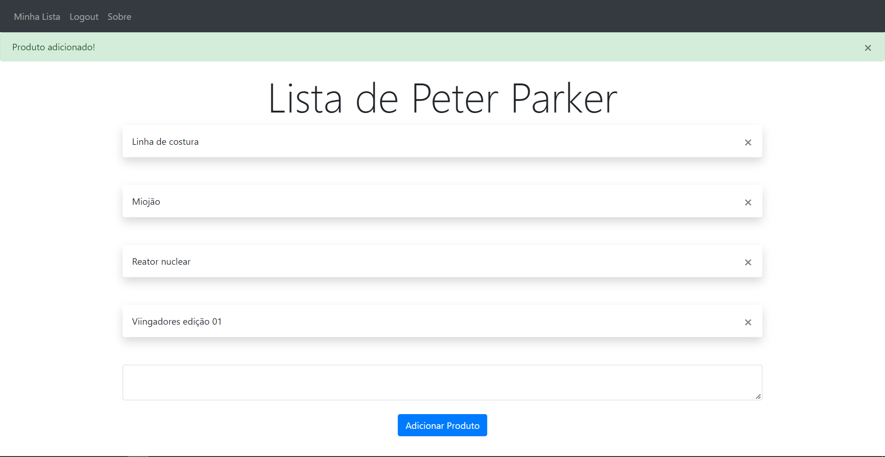
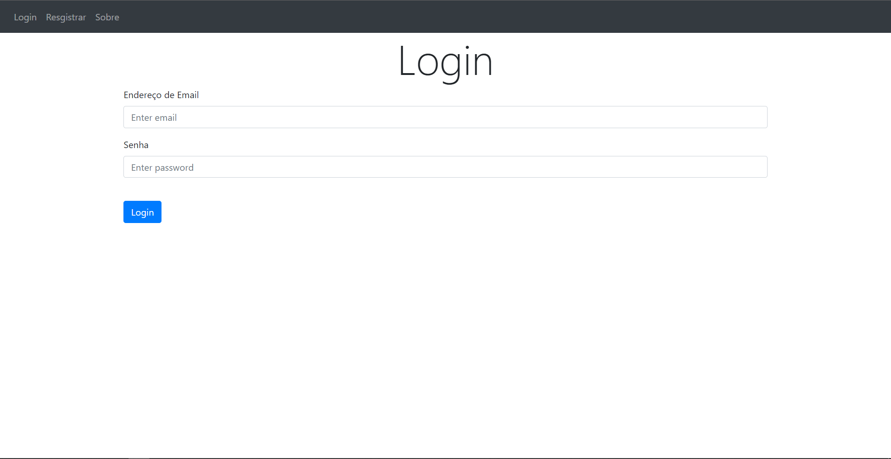
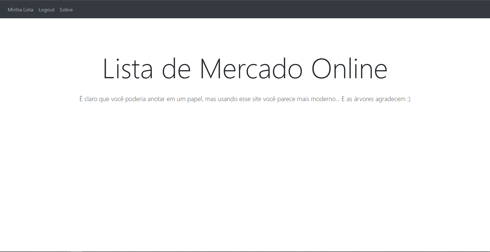

# Lista-de-Mercado-Online
Site em que o cliente pode facilmente se registrar em um banco de dados, para assim conseguir acessar seus itens de mercado de qualquer dispositivo.
O front-end foi feito com o framework web *Bootstrap*, e o back-end com framework *Flask*.

